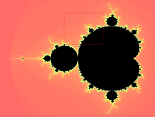
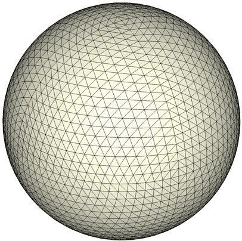

# 分形的绘制与打印

[TOC]

## webfrac
> webfrac 是一个用WebGL绘制二维分形Mandelbrot的html网页

* 可以通过拖动鼠标或是调节参数: Zoomtarget 选择放大的范围
* 按下 `d` 键放大, 按下 `ESC` 键返回最初的大小
* 实现思路：利用GPU的并行计算，在面片着色器程序中
  * 直接使用逃逸时间法, 计算当前点是否在Mandelbrot集内

## ptb_frac
> ptb_frac 是一个用Visual Studio 14.0搭建的C++工程，用于绘制二维分形

### ptb_frac的功能
提供以下分形的显示：
+ 简单的Mandelbrot集
+ 可以调节参数的Julia集的显示
+ 还有高精度浮点计算和微扰法产生的Mandelbrot集（可以放大非常多次）

### 操作指南

#### 按键
+ 点击鼠标左键，则将光标所在处作为观察中心
+ 点击鼠标右键，将所在区域放大两倍
+ 按键q，恢复原始的观察区域
+ ESC，退出程序

#### 参数调节
+ Iteration Num 为逃逸时间法的迭代次数
+ Bailout 是逃逸时间法中判断是否逃逸出去的阈值
  - 在简单Mandelbrot集中一般将Bailout设置为4，但在微扰法中取不同的值会有不同的效果
+ Formula 是Julia集的迭代公式，具体格式见后文
+ Rotation 是观察时旋转的角度

------

+ Color Mode 有RGB、YUV和HSL，具体映射公式见后文
+ Fractal Type分为Simple Mandelbrot，Julia 和 Perturbation Mandelbrot

------

+ 观察区域的参数：
  - Width: 窗口宽度
  - Height：窗口高度
  - Center_X: 窗口中心点X坐标
  - Center_Y: 窗口中心点Y坐标

------

+ 文件功能:
  - Save image: 将当前窗口内容保存为位图，快捷键为 "i"
  -  保存格式由文件后缀名决定，支持jpg，png和bmp等opencv可用的格式
  - Save vgram：将当前窗口的配置参数（窗口大小，分型类型、颜色模式）等保存下来
  -  相当于保存为矢量图，快捷键为 "o"
  - Load vgram：读入保存的参数并切换显示，快捷键为 "p"

### Julia集生成公式
+ 基本原理是运用秦九韶算法
+ 输入的公式应为(an+bni)*z^n+...+(a0+b0i)*z^0的形式
+ 实际的解析算法是以"+", "^", "z" 等作为分割符，将读到的数字依次解析为：
  - 多项式项的实部
  - 多项式项的虚部
  - 多项式项的次数
+ 对错误情况不处理

### 颜色映射方法
#### RGB模式
+ R: 逃逸距离的倒数，越"红"则逃逸距离越大，用于反映了**离分形集较远处**的逃逸情况
+ G: 迭代次数，主要用于反映**分形集的边界**
+ B: 用于表示是否在**分形集**内，分形集内为暗蓝绿色

#### YUV模式
YUV模式与RGB类似，只关心迭代次数，但颜色变化更复杂

+ **分形集内** 黑色
+ Y: 即明亮度，固定为0.4（最大值为1）
+ U：色度信号，表示迭代次数的大小
+ V：色度信号，对三取了余数用来表明变化剧烈程度

#### HSL模式
HSL模式采用对数函数（距离估计法）来使颜色均匀变化，并赋予分形边缘大量细节

+ H：色相，用逃逸距离和迭代次数相结合的"距离估计法"得到
+ S: 饱和度：固定为0.9
+ L：明度：固定为0.6

### 工程结构
+ Debug/: 中为Debug版本的32bit可执行文件以及依赖的动态链接库（运行较慢）
+ Release/: 中为Release版本的32bit可执行文件以及依赖的动态链接库
+ ptb_frac/:
  * fio.h: 提供保存位图、矢量图（本软件专用的文件格式，保存必要的参数）的接口函数
  * type.h: 提供main中用到的数据类型：颜色、分型类型参数
  * global.h: main.cpp需要include的所有内容以及所有的全局变量
  * include/: 外部库依赖头文件
    - mpfr: 高精度浮点数运算库
    - opencv2: 绝大多数格式图像导出
    - AntTweakBar.h: 简单OpenGL的GUI控件库（基于glut的版本）
  * lib/: 编译链接库，全都有32bit和64bit版本
  * spheretracing.pdf: 微扰法原理说明

### 外部库依赖
+ mpfr: 高精度浮点运算库，在微扰法中使用
+ OpenCV: 计算机视觉库，用于支持丰富格式的图片保存
+ AntweakBar：基于OpenGL的控件库，用于调节参数
+ OpenGL：使用GL_drawPixel

### 参考文献
+ 微扰法计算原理：http://www.superfractalthing.co.nf/sft_maths.pdf（ptb_frac工程中也有一份）
+ 距离估计算法(抗锯齿）: https://en.wikipedia.org/wiki/Mandelbrot_set#Continuous_.28smooth.29_coloring

## d3sim3
> 是一个用Visual Studio 14.0搭建的C++工程，用于生成3维分形STL模型，主体可执行程序是64bit的

### 工程结构
+ d3sim/：
  * main.cpp: 所有的代码
  * include/: AntTweakBar和glut的头文件
  * x64/lib/：64bit链接库
  * lib/: 32bit链接库（目前没有用）
+ x64/Release/d3sim.exe:实际应当运行的程序
+ d3sim.exe - Shortcut: 实际应当运行的程序的快捷方式（链接）
+ **ptsCld.stl**：以往生成好的3维分形Mandelbulb模型

## 算法
1.  首先构造一个球壳，由均匀的点构成的三角形mesh组成。这样的mesh可以又一个正二十面不断递归细分得到，去重的方法是使用map，**每个中点用生成该点的两个端点的序号唯一标记**。我们适当地选取球壳的半径使得mandelbulb完全在球壳内。这些均匀的点称为**采样点**

2. 使用**参考文献：链接三**中的方法可以估计每个点到mandelbulb的最小距离（实际估计出来的值要更小）
3. 将每个**采样点**向所在三角面片的**法向**移动，初始为半径方向
4. 重新估计每个采样点到mandelbulb的距离，更新移动的方向并移动采样点，不断**迭代此过程**。

## 参考链接
1. http://www.bugman123.com/Hypercomplex/index.html 多种3维分形的图片和对应的公式、参数
2. https://www.taoeffect.com/other/fractals/mandelbulb/ 用three.js 写的Mandelbulb绘制程序
3. http://blog.hvidtfeldts.net/index.php/2011/06/distance-estimated-3d-fractals-part-i/ 距离估计法（Ray marching）的详细介绍

